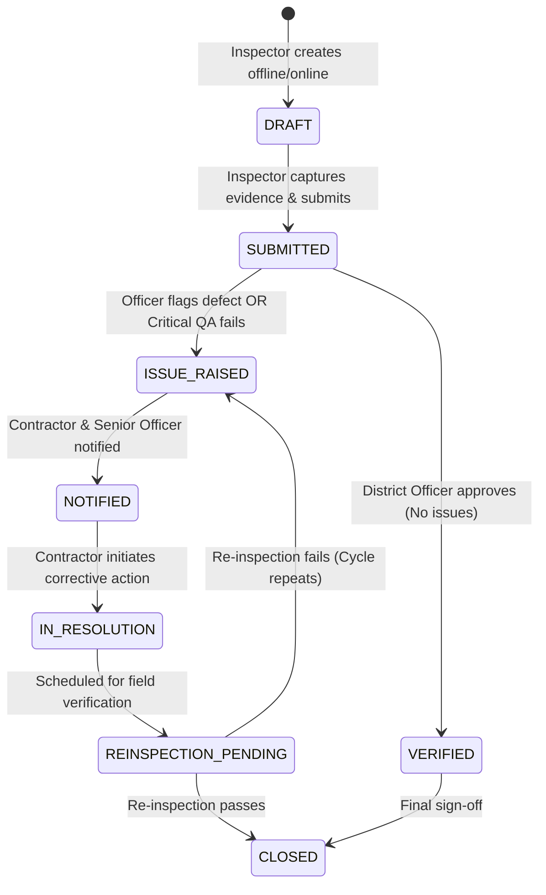

# System Architecture & Technical Specifications
**Project:** Smart Real-Time Monitoring & Inspection App
**Problem Statement:** SIH26095 | **Team:** CHAKRAVYUH | **Ministry:** MoSJE

---

## 1. High-Level Architecture & Components

```
+-----------------------------------------------------------------------------------+
|                                 CLIENT APPLICATIONS                               |
|                                                                                   |
|  +---------------------------------------+   +---------------------------------+  |
|  |     Native Android Client (Java)      |   |   Interactive Web Preview App   |  |
|  |   - Material Components (XML)         |   |   - Responsive phone frame      |  |
|  |   - Room DB (Offline Queue)           |   |   - Direct REST API integration |  |
|  |   - WorkManager (Background Sync)     |   |   - Full role switching         |  |
|  |   - CameraX + Watermark (GPS Burn-in) |   |   - Real-time simulation mode   |  |
|  |   - Retrofit 2 + OkHttp 3             |   |                                 |  |
|  +---------------------------------------+   +---------------------------------+  |
+------------------------------------------+----------------------------------------+
                                           | HTTPS / JSON REST
                                           v
+-----------------------------------------------------------------------------------+
|                                  BACKEND API                                      |
|                                                                                   |
|  +----------------------+  +---------------------+  +--------------------------+  |
|  |  Routing & Middleware|  |  Security & Auth    |  |  Core Business Engines   |  |
|  |  - REST Router       |  |  - JWT Auth (HS256) |  |  - Tender Lifecycle      |  |
|  |  - CORS & Error Hndlr|  |  - Role Guard       |  |  - State Machine Engine  |  |
|  |  - Audit Log Helper  |  |  - Data Masking     |  |  - Variance / Delay Calc |  |
|  |  - Rate Limiting     |  |  - Input Validation |  |  - Escalation & Fee Calc |  |
|  +----------------------+  +---------------------+  +--------------------------+  |
|                                                                                   |
|  +----------------------+  +---------------------+  +--------------------------+  |
|  | Storage & Filesystem |  | Integrations        |  | Reporting Service        |  |
|  | - storage/media/     |  | - DemoSmsProvider   |  | - PDF Report Generator   |  |
|  | - storage/reports/   |  | - DemoPaymentProv   |  | - CSV Import/Export      |  |
|  +----------------------+  +---------------------+  +--------------------------+  |
+------------------------------------------+----------------------------------------+
                                           | PDO / Prepared Statements
                                           v
+-----------------------------------------------------------------------------------+
|                                 PERSISTENCE TIER                                  |
|                                                                                   |
|   Database: SQLite (Zero-config default) / MySQL (Production switch via .env)      |
|   - 20+ Tables (Tenders, Milestones, Inspections, Evidence, Complaints, Audit...) |
+-----------------------------------------------------------------------------------+
```

---

## 2. Directory Layout

```
SIH PROJECT/
├── android/                             # Native Android Application (Java)
│   ├── app/
│   │   ├── build.gradle                 # Dependencies & Android configuration
│   │   └── src/main/
│   │       ├── AndroidManifest.xml      # Permissions (No gallery read access)
│   │       ├── java/com/chakravyuh/smartinspection/
│   │       │   ├── ui/                  # Activities, Fragments, Adapters
│   │       │   ├── data/                # Repositories & Models
│   │       │   ├── network/             # Retrofit API Services & Interceptors
│   │       │   ├── db/                  # Room Database, DAOs, Entities
│   │       │   └── util/                # Watermark, GPS, Converters, Constants
│   │       └── res/
│   │           ├── layout/              # XML Layouts with Material 3 styling
│   │           ├── values/              # colors.xml, strings.xml, themes.xml
│   │           └── font/                # Inter font family (Regular, Medium, Bold)
│   ├── build.gradle                     # Top-level Gradle configuration
│   └── settings.gradle
├── backend/                             # REST API (PHP 8+)
│   ├── config/                          # App, DB, Auth configurations
│   ├── database/                        # Migrations, Schema, Seeders
│   ├── middleware/                      # RoleAuthMiddleware, CorsMiddleware
│   ├── services/                        # SmsProvider, PaymentProvider, ReportService
│   ├── controllers/                     # Auth, Tender, Inspection, Complaint, Admin
│   ├── storage/                         # Database file, uploads, reports
│   ├── router.php                       # Single-entry REST API dispatcher
│   └── .env.example
├── preview/                             # Interactive Phone-Framed Web Preview
│   ├── index.html                       # Responsive container with mobile viewport
│   ├── css/preview.css                  # Chinese Orange theme styling
│   └── js/preview.js                    # Complete UI flows wired to backend API
├── docs/                                # Technical Documentation & Artefacts
│   ├── ARCHITECTURE.md                  # This file
│   ├── PROGRESS.md                      # Milestone progress & Gate checklists
│   ├── ASSUMPTIONS.md                   # Technical assumptions & constraints
│   └── screenshots/                     # UI verification captures
├── tools/                               # Environment runtimes (PHP, JDK)
└── README.md                            # Comprehensive runbook & credentials
```

---

## 3. Inspection Lifecycle State Machine

An inspection progresses through strict status transitions. Inspections with identified issues cannot be closed without a mandatory re-inspection that passes.



### Transition Validation Rules
1. `DRAFT → SUBMITTED`: Allowed only by the assigned Inspector. Requires location telemetry and at least one watermarked photo item.
2. `SUBMITTED → VERIFIED`: Allowed by District Officer.
3. `SUBMITTED → ISSUE_RAISED`: Triggered manually by District Officer OR automatically when any critical quality checklist item fails.
4. `ISSUE_RAISED → NOTIFIED`: Automatic transition on notification dispatch.
5. `NOTIFIED → IN_RESOLUTION`: Recorded upon contractor/senior acknowledgement.
6. `IN_RESOLUTION → REINSPECTION_PENDING`: District Officer schedules a re-inspection and assigns an inspector.
7. `REINSPECTION_PENDING → CLOSED`: Only permitted if the re-inspection result is marked `PASSED`.
8. Direct closure from `ISSUE_RAISED` or `IN_RESOLUTION` without re-inspection is **blocked**.
9. Every state transition is written to the immutable `audit_log`.

---

## 4. Role Matrix (Role vs. Permissions)

| Capability / Resource | Public | NGO (Pending) | NGO (Approved) | Inspector | District Officer | State Officer | MoSJE Admin |
|:---|:---:|:---:|:---:|:---:|:---:|:---:|:---:|
| **Public Tender Summary** | Read | Read | Read | Read | Read | Read | Read |
| **Contractor Contact Info** | ❌ Masked | ❌ Masked | ✅ (Attached) | ❌ Masked | ✅ (District) | ✅ (State) | ✅ All |
| **Inspector Contact Info** | ❌ Masked | ❌ Masked | ✅ (Attached) | ❌ Masked | ✅ (District) | ✅ (State) | ✅ All |
| **Evidence Media Access** | ❌ | ❌ | ✅ (Attached) | ✅ (Assigned) | ✅ (District) | ✅ (State) | ✅ All |
| **Capture & Submit Inspection** | ❌ | ❌ | ❌ | ✅ (Assigned) | ❌ | ❌ | ❌ |
| **Verify / Raise Issue** | ❌ | ❌ | ❌ | ❌ | ✅ (District) | ✅ (State) | ✅ All |
| **Assign Re-inspection** | ❌ | ❌ | ❌ | ❌ | ✅ (District) | ✅ (State) | ✅ All |
| **Create / Import Tenders** | ❌ | ❌ | ❌ | ❌ | ✅ (District) | ✅ (State) | ✅ All |
| **Approve / Reject NGO** | ❌ | ❌ | ❌ | ❌ | ✅ (District) | ❌ | ✅ All |
| **Raise Complaint** | ❌ | ❌ | ✅ (Attached) | ❌ | ❌ | ❌ | ❌ |
| **Escalate Complaint (+Fee)** | ❌ | ❌ | ✅ (Attached) | ❌ | ❌ | ❌ | ❌ |
| **Resolve / Reject Complaint**| ❌ | ❌ | ❌ | ❌ | ✅ (Escalated) | ✅ (Escalated) | ✅ All |
| **Nudge NGO (1/user/day)** | ✅ | ❌ | ❌ | ❌ | ❌ | ❌ | ❌ |
| **Audit Log & Staff Mgmt** | ❌ | ❌ | ❌ | ❌ | ❌ | ❌ | ✅ All |

---

## 5. Escalation & Fee Lifecycle

Complaints raised by attached NGOs on deficient projects traverse a hierarchical chain:
1. **Level 1 (Direct):** Senior Officer responsible for the contractor. (Free to raise).
2. **Level 2 (Escalation):** District Officer. Requires payment of ₹400 + 18% GST (₹472).
3. **Level 3 (Escalation):** State Officer. Requires payment of ₹400 + 18% GST (₹472).
4. **Level 4 (Escalation):** MoSJE Admin (Final Appeal). Requires payment of ₹400 + 18% GST (₹472).

**Resolution Outcomes:**
- **UPHELD:** The higher authority confirms the contractor fault. The fee is **automatically refunded** to the NGO, and the issue is reopened for enforcement.
- **REJECTED:** The authority confirms the original decision. The fee is **retained** to prevent malicious delays.

---

## 6. API Route Outline

### Auth & Public Access
- `POST /api/auth/login` - Staff login (email/password)
- `POST /api/auth/otp/request` - Public user OTP request (rate limited: 5/hr)
- `POST /api/auth/otp/verify` - Public OTP verification
- `POST /api/auth/ngo/register` - NGO registration with credential document
- `POST /api/auth/refresh` - Refresh JWT token
- `POST /api/auth/logout` - Invalidate session

### Tenders & Milestones
- `GET /api/tenders` - List tenders (role-masked, filtered by category, district, status)
- `GET /api/tenders/{id}` - Tender details with milestone progress and budget variance
- `POST /api/tenders` - Create tender (Admin, State, District)
- `POST /api/tenders/import` - CSV bulk tender import with detailed report
- `GET /api/tenders/template` - Download CSV template
- `POST /api/tenders/{id}/assign` - Attach inspectors or NGOs

### Inspections & Evidence
- `GET /api/inspections` - List inspections (filtered by role/jurisdiction)
- `GET /api/inspections/{id}` - Inspection details with evidence items
- `POST /api/inspections` - Create/sync draft inspection
- `POST /api/inspections/{id}/evidence` - Multipart upload with watermark, GPS, and timestamp validation
- `POST /api/inspections/{id}/submit` - Submit inspection for verification
- `POST /api/inspections/{id}/verify` - District Officer verify or raise issue
- `POST /api/inspections/{id}/reinspect` - Schedule and submit re-inspection
- `POST /api/inspections/{id}/close` - Close inspection (requires passed re-inspection if issue was raised)

### Complaints, Escalations & Payments
- `POST /api/complaints` - Raise complaint on attached tender
- `GET /api/complaints/{id}` - View complaint history and timeline
- `POST /api/complaints/{id}/escalate` - Initiate escalation (creates payment order)
- `POST /api/payments/confirm` - Confirm demo payment and advance escalation
- `POST /api/complaints/{id}/resolve` - Senior or higher authority resolve/reject (triggers refund if upheld)

### Transparency, Public & Nudges
- `POST /api/nudges` - Nudge NGO on project (1/day rule, >=10 char reason)
- `GET /api/reports/inspection/{id}/pdf` - Generate & download inspection PDF report
- `GET /api/reports/tenders/csv` - Filtered export of tender metrics
- `GET /api/dashboard/summary` - Statistical aggregations by status, variance, and district

### Admin & Staff Management
- `POST /api/admin/users` - Create staff user account
- `PUT /api/admin/users/{id}/status` - Deactivate / activate staff account
- `GET /api/admin/audit-log` - Comprehensive audit log
